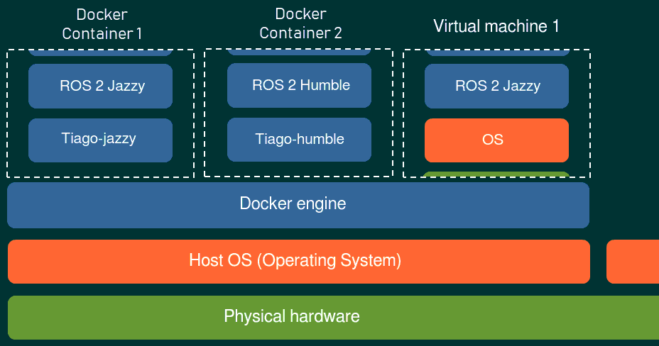
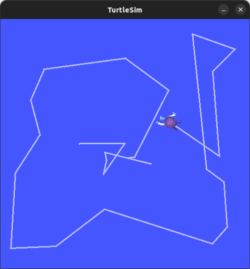
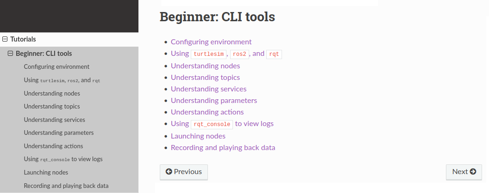
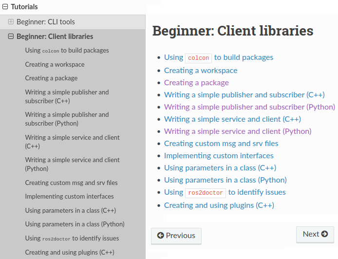
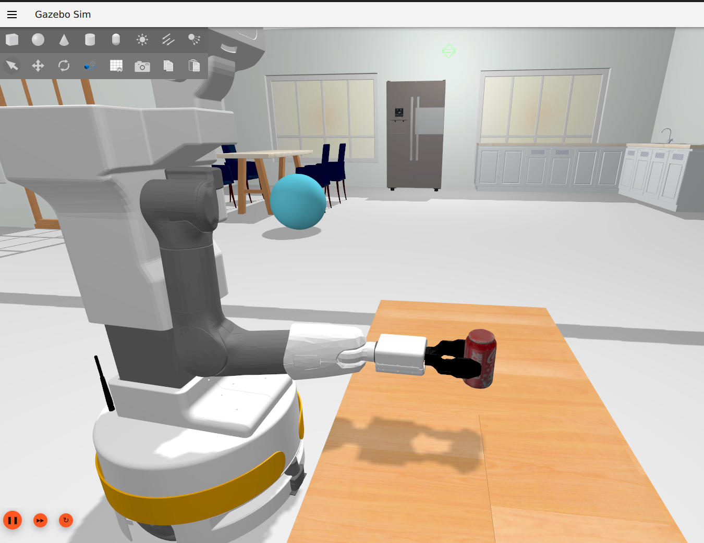
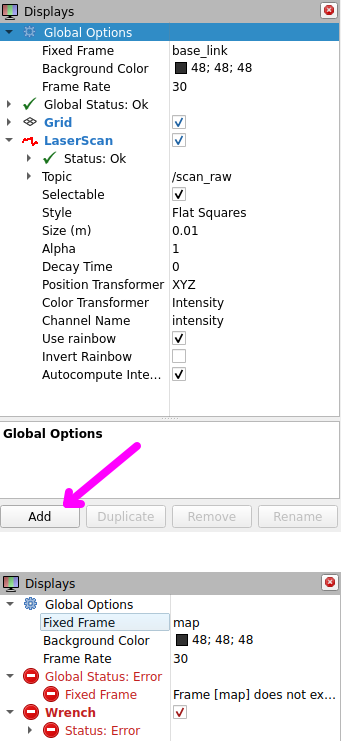

<!-- 
class: invert
paginate: true
title: ROS 2 exercises for Cboost
author: 'Yoan Mollard'
-->

<style>

section {
  background-image: url('assets/ros-background.svg');
  background-size: cover;
  display: flex;
}

</style>

#  ROS 2 Training Exercises

*Yoan Mollard, for Nobleprog*

[Switch back to course](/)


---

**Exercises for DAY 1**

1. [ Prepare Your Work Environment](#3)
2. [ `turtlesim`, CLI Tools](#6)
3. [ `turtlesim`, Client Libs](#8)
4. [ RMW Bridge to TCP/IP, MQTT or WS](#9)

**Exercises for DAY 2**

5. [ Discover Tiago's ROS 2 Integration](#10)
6. [ Tiago 2D Navigation](#18)
7. [ Demonstrate micro-ROS](#20)

**Exercises for DAY 3**

7. [ Tiago Manipulation with the Arm / Gripper](#21)
8. [ Motoman hc10dtp/BFFP Manipulation](#27)
9. [ Demonstrate MoveIt Servo](#28)

---

# Exercise 1: Prepare Your Work Environment

You need to install ROS 2 Jazzy:

- **Option A**: With a container (preferred option for the training)
- **Option B**: Install ROS natively on Linux, Windows or MacOS
- **Option C**: Install ROS in a VM

**Options B/C**: Pick an OS that is **Tier 1** for your ROS version (tier 1 = fully supported)

**Option C**: Make sure that 3D hardware acceleration is enabled. Not-that-great option for Gazebo simulation, also for network management.

---



---

### The Jazzy Container setup for the course

Pre-installed devices:
- **PAL Tiago**, but in alpha version (FT sensor broken + some bugs) 🙁
- Motoman hc10dtp
- BFFP

Download the container:
``` bash
git clone https://github.com/cboostpverwimp/ros2-course
```
Install [Visual Studio Code](https://code.visualstudio.com/Download) and start the container:
```bash
code ros2-course/
```

Upon startup, click **Trust the authors**, accept the installation of the **Dev Container** extension, and reopen the folder in the container. Read the [README](https://github.com/cboostpverwimp/ros2-course).

---

# Exercise 2: `turtlesim`, CLI Tools

**The `turtlesim` Robot**



- 2D "visual" turtle robot
- Simulates a wheeled robot (Turtlebot, Husky, etc.)
- Velocity control (*r, θ*):
  - Linear velocity *r* (in m/s)
  - Angular velocity *θ* (in rad/s)
- Stops automatically without receiving a new command

---

Follow the ROS tutorials in the `Tutorials > Beginner: CLI tools` category.



https://docs.ros.org/en/jazzy/Tutorials/Beginner-CLI-Tools.html

---

# Exercise 3: `turtlesim`, Client Libs

Follow the tutorials in `Tutorials > Beginner: Client libraries`.



https://docs.ros.org/en/jazzy/Tutorials/Beginner-Client-Libraries.html

Follow at least purple tutorials ➡️

``` bash
# If RAM is saturated during compilation:
sudo dd if=/dev/zero of=/swapfile bs=1M count=8000
sudo mkswap ~/swapfile
sudo swapon ~/swapfile
# compile... then disable swap
sudo swapoff ~/swapfile
rm ~/swapfile
```

---

# Exercise 4: RMW Bridge to TCP/IP, MQTT or WS

Setup a PoC that demonstrate a bidirectionnal communication between the RMW and a MQTT or TCP/IP or WebSocket.

You can cover: topics, service calls, action services (e.g. Nav2 goal)

**Example A**: IMU sensor connected to a PLC, streaming both:
- a `/imu` topic of type `sensor_msgs/Imu`
- a `TF` frame, viewable in RViz (use a TF Broadcaster)

Make it a `rclpy.lifecycle.LifecycleNode` so that it can be started/stopped.

**Example B**: Motor drive connected to a PLC (or Gazebo), commanded via a HTML GUI through WebSockets (see [`rosbridge` for ROS 2](https://integration-service.docs.eprosima.com/en/v3.1.0/examples/different_protocols/pubsub/ros2-websocket.html)) 

---

# Exercise 5: Discover Tiago's ROS 2 Integration

In all parts, refer to the
[summary of commands from the container README](https://github.com/cboostpverwimp/ros2-course)

First start the Gazebo simulation of Tiago + teleoperation and observe the RTF percentage at the bottom right:

**Real Time Factor (RTF)**: RTF indicates how fast Gazebo can simulate the scene. It is configured to be at 100%.

Below 100%, the simulation is slowed down, because of performance issues. Below 50%, it might be unusable.



---

## Part 1: Monitor Joint States

With a ROS 2 CLI command, monitor the `/joint_states` topic representing the current state of all the robot's joints: their angular position, angular velocity, and torques.

How many joints do you find on this robot? <!-- 14 -->

Identify the names of the 2 joints among these that do not have torque sensors. You will recognize them because they return the value NaN = Not A (valid) Number. <!-- left wheel and right wheel -->

Using `ros2 topic hz <topic>`, determine the frequency (in Hertz) at which the robot publishes the state of its joints on this topic.
Is this frequency sufficient to implement motor control?

---

## Part 2: Plot Joint States: Second Head Motor

Start the graphical trajectory controller: this allows individual control of each joint:

```
ros2 run rqt_joint_trajectory_controller rqt_joint_trajectory_controller
```

Try different motor controllers available in the list. Activate each controller with the red button and move the angular commands of the joints. Verify that your robot moves in Gazebo.

To continue, choose the head controller: it has two joints.

We will focus on `head_2_joint`.

---

Plotjuggler is a tool that plots curves in real-time (better than rqt_plot).

Start Plotjuggler: `ros2 run plotjuggler plotjuggler`

On the left in **Streaming**:
- Set the buffer to 120 seconds
- Click **Start** for **ROS 2 Topic Subscriber**
- Choose `/joint_states`
- Expand `joint_states` in the list on the left and open the `head_2_joint`
- Drag its torque value to the graph on the right to start

The graph fluctuates a lot, but observe the scale: it's just noise.

Move `head_2_joint` with the graphical controller and observe the effort graph in real-time.

---

## Part 3: Monitor Sensors with RViz

Start RViz2: `ros2 run rviz2 rviz2`

Click **Add** to add new `Display` components to visualize and configure them by expanding their config ➡️

For each of the topics on the next page, use both the CLI (`ros2 topic echo`) and RViz2 (if possible) to visualize their data.

Teleoperate the robot to place it in front of or away from obstacles to observe differences in the data.

🛑 Make sure neither RViz2 nor the Display is in error ➡️



---

- LIDAR data (`scan_raw`)
- Inertial measurement unit data (`/imu_sensor_broadcaster/imu`)
- ~~Force sensor (`ft_sensor_controller/wrench`)~~ (broken in Jazzy / [working on it](https://github.com/ros-controls/ros2_controllers/issues/1522))
- Sonar data (`sonar_base`) (sensor simulation works weirdly in Jazzy)
- The robot's transformation tree with a `TF` type display.
In the tree, identify where the robot's IMU is located by checking only the `frame` (= reference frame) corresponding to its attachment (`base_imu_link`).
Which axis `x`, `y`, or `z` points forward on the robot?
- Odometry `/mobile_base_controller/odom`:
    - In the CLI, extract the position from each message by selecting a field: `--field pose.pose.position`
    - In RViz2, change the global frame to that of the messages (`odom`)
- The robot's URDF model (`robot_description`, via a `RobotModel` display)

---

Finally, with an `Image` display, also visualize the raw uncompressed RGB-D camera images in RViz2:
- `image_raw` for the raw image
- `rgb` for the RGB image
- `depth_registered` for depth (`registered` means the image is realigned for pixel-to-pixel correspondence with the RGB image)

ℹ️ If the depth image appears striped, it is a RViz2 bug. Use another ROS tool to visualize it:
``` bash
sudo apt install ros-jazzy-image-tools
ros2 run image_tools showimage image:=/head_front_camera/depth_image
```

ℹ️ RViz2 cannot decompress compressed images itself. If needed, use `ros2 run image_transport republish` for decompression.

---

## Part 4 (if needed): Modify SDF worlds/models in Gazebo

Simulated worlds and models (objects) are SDF files that you can manually edit.

Some models are static: they are not subject to forces, not even gravity. To change this, modify `<static>false</static>` in the SDF.

There are many opensource pre-designed worlds, eg https://github.com/aws-robotics/ (take the Jazzy or ROS 2 branch. ⚠️ Complex worlds will be slow)

ℹ️ Download models from the **Fuel server**: https://app.gazebosim.org/

ℹ️ Modify a model: [sdf_worlds/#download-the-model](https://gazebosim.org/docs/latest/sdf_worlds/#download-the-model)

Remember to compile and source after modifying a world or model.

---

# Exercise 6: Tiago 2D Navigation
## Part 1: Teleoperated Navigation

Consult the container README to obtain the commands to teleoperate the robot's mobile base using the keyboard.

Open `rqt_graph` as seen in previous tutorials and note the hierarchical name (with slashes) of the velocity command topic for the mobile base.

Two other nodes are present between the teleoperation node and the mobile base controller: a **multiplexer** (mux) + a **stamper**.

---

## Part 2: Autonomous Navigation

Consult the container README to obtain the commands to:

1. Map the simulated scene using SLAM according to the documentation.

2. Save the map to a file named `our_map` and then **CLOSE** SLAM.

3. Start `tiago_nav2d` to use the saved map by giving a goal in RViz.

4. Move the robot to a target position using teleoperation and retrieve its position on the map from the `/amcl_pose` topic.

5. Develop an `rclpy` node in a new package to reach the target at the recorded coordinates (Drafts [C++ and Python](https://gitlab.com/ymollard/humble-ros-cremi/-/tree/main/snippets)).

6. Set up an infinite patrol of the robot between 2 points.

7. Insert an obstacle in Gazebo in the middle of the path: it should be avoided.

---

# Exercise 7: Demonstrate micro-ROS

1. Flash the microcontroller with the microROS firmware
2. On the host machine, create a ROS 2 node that will act as the micro-ROS agent
3. Retrieve data from/to the microcontroller e.g.:
  - `/battery_status` of type `sensor_msgs.msg.BatteryState`
  - `/imu` of type `sensor_msgs.msg.Imu`

[Rely on that video demo](https://youtu.be/wgIKGUGSX7Y)

---

# Exercise 8: Tiago Manipulation with Arm/Gripper

## Part 1: Kinematics

With the help of the container README, start MoveIt2 to display the colored manipulation handles in RViz.

Move the handles to define a target that does not put the robot in collision, then click **Plan & Execute** to execute the movement to the target.

Which fundamental mathematical function in robotics is used each time you move the handles (without clicking anything else)?

In the **Joints** tab, move the **Nullspace exploration** slider. What does this space of movement correspond to?

---

## Part 2: Planning

Three robots of different colors overlap in RViz:
- Real colors (black and white)
- Orange
- Transparent (only briefly visible with each click on **Plan & Execute**)

What is the difference between the three?

To answer, use the **Query X** checkboxes in the **Planning Request** dropdown list in the RViz displays.

Do you know an algorithm that could be triggered to perform the planning of the **Plan & Execute** button?

---

## Part 3: Collision Avoidance

Open the **Context** tab and in the OMPL dropdown list, verify that it is in the list of available planners.

In the RViz displays, uncheck all necessary boxes so that your robot no longer appears at all. Then check only these: **MotionPlanning** ➡️ **Scene Robot** ➡️ **Show Robot Collision**.

Observe the collision model in grayscale.

Restart RViz to reset the displays.

---

In the **Scene Objects** tab, insert a **Box** and move it in front of the robot so that it is not in collision but obstructs its passage.

Define a target and click **Plan & Execute**. Verify that the object is avoided.

*There seems to be a bug in this version of RViz that makes manipulating the scene object difficult and causes it to crash. If it is unusable, skip to the next part.*

---

## Part 4: Other Joint Groups of Tiago

In RViz, the **Planning group** list includes not only the arm but also `arm_torso` and `gripper`.

Try different **Plan & Execute** targets with the kinematic chain `arm_torso`.

Test also the `arm` group to observe the difference. 

Finally, try with `gripper`. The gripper is not kinematic chain, so it has no colored handles. Use **Start State: random valid** to open and close the gripper\*.

\* *Not very handy but fortunately this can be commanded from Python. Also, static poses could have been saved to the SRDF so that they can be cliked in MoveIt (e.g. **open_gripper**)*

---
## Part 5: Automate the Arm

We will control the arm with Python code. A draft node is already coded in the `tiago_pick_and_place` package.

With the help of the container README, open the node's code and execute it using its launchfile `plan.launch.py`.

This code is in 3 parts corresponding to 3 different trajectory plans. For each of them, take the time to understand the code and test it. Use triple quotes to (un)comment a section of code.

- Plan 1: Define a target in joint space.
- Plan 2: Define a target in Cartesian space.
- Plan 3: Open and close the gripper.

---

# Exercise 9: Motoman hc10dtp/BFFP Manipulation

TODO: I don't know yet how to guide learners to use these robots :)

---

# Exercise 10: Demonstrate MoveIt Servo

TODO: I don't know yet MoveIt Servo either, and I'm unsure about the difference with MoveIt relying on the regular ros2_controllers/ros2_control framework

MoveIt Servo facilitates realtime control of your robot arm. MoveIt Servo accepts any of the following types of commands:

- Individual joint velocities
- The desired velocity of end effector
- The desired pose of end effector

Try to demonstrate MoveIt Servo on Motoman hc10dtp/BFFP.

[See MoveIt Servo doc](https://moveit.picknik.ai/main/doc/examples/realtime_servo/realtime_servo_tutorial.html)