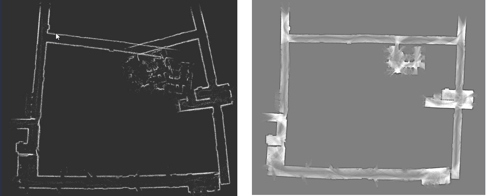
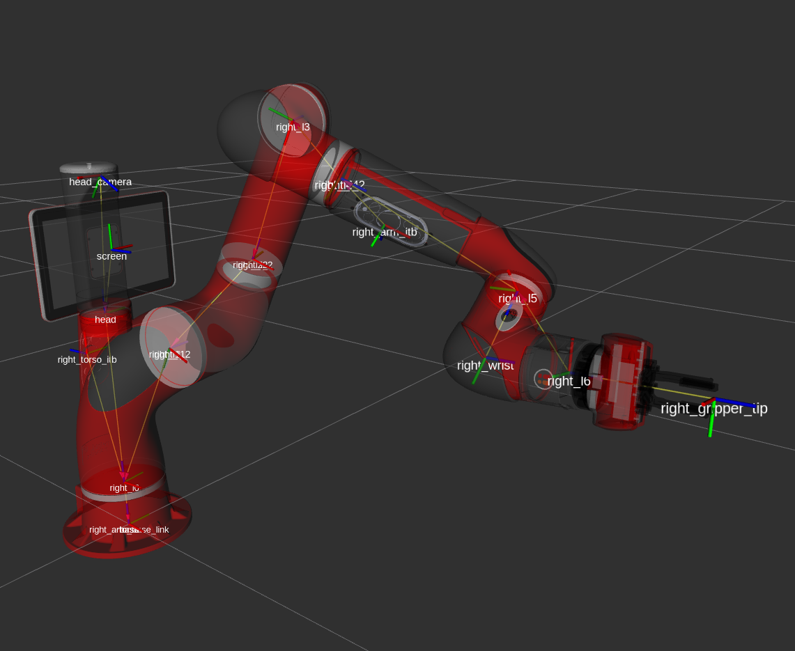

<!-- 
class: invert
paginate: true
title: ROS 2 course for Cboost
author: 'Yoan Mollard'
-->

<style>

section {
  background-image: url('assets/ros-background.svg');
  background-size: cover;
  display: flex;
}

</style>

#  ROS 2 Training Course

*Yoan Mollard, for Nobleprog*

Read slides on:
🔗 [`https://ros2cboost.netlify.app`](https://ros2cboost.netlify.app)

[Switch to exercises](/exercises)

While we're waiting, install [Visual Studio Code](https://code.visualstudio.com/Download) and type:
``` bash
git clone https://github.com/cboostpverwimp/ros2-course
code ros2-course/
```


---


---


---


---


---


---


---


---

1. [ Introduction to ROS 2](#12)
    1.1. [ Overview of the ROS Ecosystem](#12)
    1.2. [ Overview of ROS Functional Tools](#20)
    1.3. [ A Plumber's Toolkit to Build your Robot](#34)
    1.4. [ The ROS Governance](#37)
2. [ Key Technical Concepts](#41)
    2.1. [ Structure of ROS Projects](#42)
    2.2. [ The ROS 2 CLI: Nodes, Topics, Parameters](#47)
    2.3. [ Asynchronous Services and Action Services](#51)
    2.4. [ RMW configuration and QoS](#54)
    2.5. [ ROS Workspaces](#58)
    2.6. [ Starting Nodes: run and launch files](#61)
    2.7. [ Cloud Robotics Opening](#62)


---

3. [ Developing Code with ROS](#64)
    3.1. [ File Hierarchy](#65)
    3.2. [ ROS Client Library (RCL) for Python and C++](#72)
    3.3. [ The 3 Types of Nodes and Their `executor`](#73)
    3.4. [ ROS 1 vs ROS 2: Key changes](#83)
4. [ Integration of a System into ROS 2](#85)
    4.1. [ What is a System "Integrated" into ROS 2?](#86)
    4.2. [ Standard Data Message Formats](#89)
    4.3. [ Example of a Good Integration: PAL Tiago](#94)
    4.4. [ Other Tiago Integrations to ROS 2 Tools](#96)

---

5. [ Navigation 2 with ROS 2](#97)
    5.1. [ 2D Robot Localization and Navigation](#98)
    5.2. [ Mapping and SLAM](#103)
    5.3. [ Simultaneous Localization and Mapping (SLAM)](#106)
    5.4. [ Path Planning](#109)
    5.5. [ Trajectory Tracking](#111)
    5.6. [ Other tools from Nav2](#113)
6. [ Manipulation Robotics with MoveIt 2](#114)
    6.1. [ The URDF (Unified Robot Description Format)](#115)
    6.2. [ The SRDF (Semantic Robot Description Format)](#116)
    6.3. [ The `tf2` Transformation Tree](#118)
    6.4. [ Trajectory Planning: OMPL](#123)
    6.5. [ Overview of MoveIt 2](#128)

<!--
DAY 1: Introduction to ROS 2

    The ROS 2 Command-line interface
    The ROS 2 middleware and QoS (topics, services, actions) - opening to cloud robotics here
    The ROS Client Library for Python nodes (rclpy) and TF2
    Structure of ROS 2 codebase of projects and workspaces

DAY 1 Labs:  We split in 2 groups: 

    The very beginners to ROS (1 or 2) will practice ROS 2 basics. The official tutorials with turtlesim are a good basis to rely on, and we'll customize them so that we put TF2 into practice as well.
    Meanwhile, the group of ROS 1/2 knowers (at least Patrick? 😎) can setup a PoC using mqtt_client and/or TCP/IP, e.g. an IMU sensor connected to the PLC, streaming on ROS 2 topics or TF frames

DAY 2: Wheeled robot navigation with Nav 2

    Use of odometry and sensors for robot localization
    Simultaneous Localization And Mapping
    Path planning and path tracking, from GUI and Python nodes
    How the actuators/sensors of a wheeled robot are integrated to ROS: LIDAR, RGB-D, IMU, joint states and controllers

DAY 2 Labs: We split into several groups. Each of them pick a simulated wheeled robot plateform, perfom navigation into Gazebo, and understand the nodes implementation (Tiago, Husky, or Turtlebot should do the job)

DAY 3: Manipulation with MoveIt 2

    URDF/SRDF of a robotic arm, and automated generation with Xacro
    The Open Motion Planning Library for path planning
    How the actuators/sensors of an arm are integrated to ROS: joint states, joint controllers, force sensors

DAY 3 Labs: We split into several groups. Each of them pick a simulated or real robotic arm (Panda, HC10DTP, UR3, Tiago ...), and perform path planning through MoveIt, GUI and XX nodes*

########################################

Basic ROS2 concepts, colcon workspaces, messages, topics, services, actions, ros2_control, params and TF
Creating ROS2 packages; nodes, .launch.py files, etc. (preferably in Python3)
Using Rviz2 and rqt
Using Gazebo Sim (gz-sim9+), creating SDF's, optionally plugins
Setting up and implementing URDF's and SRDF's, using xml and xacro
Working with MoveIt2, optionally MoveIt Servo 
-->

---

# Introduction to ROS 2
## Overview of the ROS Ecosystem

---

### The Robot Operating System (ROS)

Open-source ecosystem for creating robot control software:
- **Libraries** for trajectory calculation, communication, motor control, etc.
- **Applications** for physical simulation, sensor visualization, data recording and playback, debugging, etc.
- **Conventions** for robot representation, communication by sensor or actuator type
- **Community**: tutorials and videos, reusable open-source components, support forums, etc.

---

### History of ROS

- 2010: Release of ROS 1 by Willow Garage for the PR2 robot (*pictured*)
- 2012: ROS Industrial: subproject aimed at transferring ROS to industry
- 2012: Creation of OSRF (Open Robotics)
- Multiplication of compatible robots
- 2017: Release of ROS 2 (major version)


---

### ROS Distributions (Versions)


- ROS 1 Noetic Ninjemys will reach end-of-life in 2025
- Many ROS 2 packages have been named after their ROS 1 equivalents but with the addition of a 2, for example **Nav 2** or **MoveIt 2**

ℹ️ Although there are communication bridges, in general, ROS 2 is not backward compatible with ROS 1. A ROS 2 package must therefore work on ROS 2 with other ROS 2 packages.

---

### Who Uses ROS and for What?

- For **robot designers**
- For the software engineering team
- To accelerate the creation of new robotic control software
- For unpredictable environments (adapting to obstacles)
- For advanced robotic programs (sensor analysis, AI, complex trajectories or motor control, etc.)
- To create a robot that is interoperable with other actuators, sensors, and software components

ROS is not intended for **robot users**.
Not suitable for simple automation tasks (e.g., pick-and-place).

---

### The Advantages of ROS

- Save engineering time by relying on existing building blocks
- Benefit from the entire compatible ecosystem (*state of the art*)
- Reduce technical debt with a modular, interchangeable architecture
- Make your system interoperable thanks to the standards created by ROS
- Facilitate hardware and software extension by integrators
- Free yourself from dependence on specific software (*vendor-locking*)
- Benefit from community and professional technical support

---

### The Drawbacks of ROS
- Standards that do not suit **all** situations
- A certain complexity of learning
- Limited compatibility with non-Linux OS
- Rapid development cycles leading to obsolescence
- Some bugs, including regression bugs (testing will improve it!)
- Light documentation (tutorials, demos with code snippets but no lib doc)

---

### Types of Robots Managed

- Wheeled robots (AGV, AMR)
- Flying robots (UAV)
- Manipulator cobots
- Legged and humanoid robots
- Independent sensors or actuators

For a robot to be **compatible**, there must be a **ROS driver** for it developed and maintained by the manufacturer, a laboratory, or the community.

**Publicly listed ROS robots**: [https://robots.ros.org/](https://robots.ros.org/)

---

## Overview of ROS Functional Tools
The modules and tools you can use in your robotic system...

---

### Software Messaging (RMW)

The middleware (RMW) ensures robust **software communication** between software components via an Ethernet or WiFi network.

Optional RMW functionalities:
- Quality of Service (QoS)
- Authentication
- Encryption with `sros2`

The RMW defines several communication modalities:
- Messages published on topics (publisher-subscriber)
- Service call (request-response)
- Parameters ("external variables" of a node)

---


---

### RViz (ROS Visualizer)

The 2D and 3D visualizer of ROS, which allows you to overlay different views: robots, obstacles, camera images, point clouds from sensors, etc.

**Objectives**: assist with debugging / build HMIs (Human-Machine Interfaces).

---


---

### Foxglove Studio (3rd party Web viz studio)


RViz competitor, but web-based, developped by the Foxglove company. [See doc](https://docs.ros.org/en/jazzy/How-To-Guides/Visualizing-ROS-2-Data-With-Foxglove-Studio.html).


---

### Gazebo (Physical Simulator)

The physical simulator of ROS with an interchangeable physics engine (ODE, Bullet, Dart, Simbody) for rigid or soft bodies.

Other ROS-compatible simulators: Webots, CoppeliaSim, Unity 3D, etc.

**Objective**: validate the behavior of the robot in a near-real environment

---


---

### Motor Control

**ROS Control** is an abstraction interface for universal motor control.

**Objective**: make the software independent of the hardware motor model


---

### Moveit, the ROS Subproject for Arms

**Objective**: calculate trajectories and models

🖱️ [moveit.ros.org](https://moveit.ros.org)

#### Example with Franka Panda arm


---


---

### Nav2, the ROS Subproject for Navigating Robots

**Objective**: trajectory calculation and mapping

🖱️ [nav2.org](https://nav2.org/)

#### Example with Clearpath Husky


---


---

### Autoware, the ROS Subproject for Autonomous Vehicles


**Objectives**: trajectory calculation, perception of signaling, other vehicles, obstacles, etc.

🖱️ [autoware.org](https://autoware.org)

---


## A Plumber's Toolkit to Build your Robot Software

Several ready-to-go packages for your own robot code:

#### Localization Sensor Fusion

Popular nodes implementing Kalman filters to fuse 2D or 3D localization sensor data.

[Doc of `robot_localization` pkg](https://docs.ros.org/en/noetic/api/robot_localization/html/index.html)


---

#### Behavior Trees (BT)
**BT.cpp + pytrees**

- Describe complex behaviors
- Replace state machines
- Trees of actions and conditions
- Sequential, parallel, fallback flows
- GUI available (groot2)


[BehaviourTree doc for ROS 2](https://www.behaviortree.dev/docs/ros2_integration/)

---

#### But also (the full list is long)...

- Universal description of all kinds of robots (URDF)
- Dated geometric transformations (`tf2`)
- Data recording and playback (`rosbag`)
- Centralized log console (`rqt_console`)
- Global view of software components and their communication (`rqt_graph`)
- Global view of the system's Cartesian frames (`view_frames`, `tf2_monitor`)
- Real-time curves (Plotjuggler or `rqt_plot`)

These tools are used independently of each other, as needed.
Consult their documentation for details.

---

## The ROS Governance

---

### Who Develops and Maintains ROS?

Development is overseen by the Open Robotics Foundation (OSRF) with a technical steering committee ➡️

Contributions to this open-source software are made by the **community**: companies, laboratories, enthusiasts, etc.


---

### How is ROS Developed?
### ROS Enhancement Proposals (REP)

REPs are the rules governing the ROS ecosystem, its standards, and conventions.

Each REP is proposed, discussed, adopted/rejected/delayed, and then implemented.

The [REP 000](https://www.ros.org/reps/rep-0000.html) is the list of all REPs.

---

### Complex Boundaries to Define

The community-based operation makes it complex to enumerate all ROS packages to get an overall view of the functionalities:

- Nav2 is not managed by the Open Robotics foundation
- MoveIt2 is not managed by the Open Robotics foundation
- Autoware is not managed by the Open Robotics foundation
- Foxglove is not managed by the Open Robotics foundation
- AWS Robomaker/NVidia Isaac.... are not managed by the foundation
- Many open-source packages are also not managed by the foundation...

---

# Key Technical Concepts

---

## Structure of ROS Projects
### Nodes, Topics, and Services

- A node is an executable program, for example:
  - a Python script
  - a compiled C++ executable

A node is generally responsible for well-defined tasks, for example:
- Node #1: Analyzes the camera image (Python script)
- Node #2: Calculates the trajectory to the target (Python script)
- Node #3: Controls the motors to reach the target (C++ executable)

---

### Hierarchy of Files in Packages
A package is a set of thematic resources in the form of a folder.

It can contain:
- C++ or Python executable files (nodes)
- Configuration files
- Data files (photos, videos, etc.)

---

### Inputs and Outputs of a Node

A node can:
- Consume input data (subscribe)
- Produce output data (publish)

This data is exchanged on communication channels called **topics**.

On a topic, you can find:
- Either individual messages (e.g., images)
- Or services, each composed of:
  - a request
  - the associated response

---


---

Each topic has:
- a name, often hierarchical similar to files and folders, e.g., `/cameras/front/image`
- a type, which characterizes the type of message or service it carries, e.g., `Image` (message) or `GetPosition` (service):
  - Existing standard type
  - Custom type (see ROS tutorials *custom interfaces*)

---

## The ROS 2 CLI: Nodes, Topics, Parameters

List all running nodes:

```bash
~$ ros2 node list

/robot/vision/analyzer
/robot/trajectory_follower
/robot/motors/left
/robot/motors/right
```

Each active node is an instance of a C++ or Python executable.

The same executable can be instantiated multiple times with different parameters.

The node name can be hierarchical but does not reflect the file hierarchy.

---

### List All Open Topics

```bash
~$ ros2 topic list

/robot/vision/target
/robot/left_motor/cmd_vel
/robot/right_motor/cmd_vel
```

A topic is open if there is at least 1 subscriber waiting for messages or 1 publisher producing messages.

---

### Get Info on a Node/Topic

```bash
~$ ros2 topic info /robot/left_motor/cmd_vel
Type: geometry_msgs/msg/Twist
Publisher count: 1
Subscription count: 1
```

The complete message type is prefixed with the package in which it is declared, here `geometry_msgs`

To see who the publishers and subscribers are, see `rqt_graph` (in exercise).

---

### Node Parameters
Parameters are "global variables" declared and typed **in the code** of the node but can also be read and modified externally (shared parameters).

The ROS 2 CLI for node parameters:
- `ros2 param list`
- `ros2 param get /node_name <param_name>`
- `ros2 param set /node_name <param_name> <new_value>`

---

## Asynchronous Services and Action Services

Communication in two steps: 1-Request, then 2-Response

The ROS 2 CLI for services:

- `ros2 service list`
- `ros2 service info /motion/start` *(useful to get the type, e.g., StartMotion)*
- `ros2 service call <topic_name> <service_type> <request>`

Example of an asynchronous service: `/motion/start` of type `StartMotion` to trigger a robot movement at the client's request:
- **Request**: name of the movement, duration of the movement execution
- **Response**: boolean `True` if the movement was executed, `False` otherwise

---

Action Services are like regular services but suited for long actions targeting goals (e.g. trajectories executions)
- regular feedback to be sent back to the client
- goal acceptance or refusal
- final state (success, canceled, preempted, failed, ...)

Action services are implemented as:
- 1 service for goal sending
- 1 topic for the feedback
- 1 service to get the result

---


---

## RMW configuration and QoS
### Domains to Limit the Scope of the Middleware
The **middleware** (RMW = ROS middleware) is the communication mechanism of ROS in topics, services, and parameters, named hierarchically and typed.

By default, this communication is limited to the Ethernet network.

To create independent RMW subnets, define a **domain id**

``` bash
code ~/.bashrc
export ROS_DOMAIN_ID=999  # Value 999 forbidden: choose between 1 and 101
```

A different ID is **essential** for each subgroup during training.

---

### The Quality of Service of the Middleware (QoS)

Each publisher, subscriber, or action creates a profile configuring its QoS:
- **Depth**: Buffer size
- **Reliability**: `RELIABLE` (message acknowledged) or `BEST_EFFORT`
- **Durability**: Retains messages for future subscribers `TRANSIENT_LOCAL` or `VOLATILE`
- **Deadline**: Delay before the next message must arrive (e.g., 50Hz publication)
- **Lifespan**: Expiration date of a message
- **Liveliness**: Communication monitoring

---

### Changing the Middleware of the RMW

The default middleware is **Fast DDS** (Fast RTPS), an implementation of the **DDS standard** (Data Distribution Service, OSI layers 5 to 7).

Other DDS or non-DDS implementations, open-source or not, can be chosen:

``` bash
export RMW_IMPLEMENTATION=rmw_fastrtps_cpp     # in .bashrc
```

For example: `rmw_cyclonedds_cpp` (open-source, for microcontrollers), `rmw_connext_cpp` (highly customizable QoS, and proprietary).

Each component of the network can use a different DDS implementation.

All DDS implementations of the RMW are compatible with each other, but not with non-DDS implementations like Zenoh.

[🔗 Documentation on RMW implementations](https://docs.ros.org/en/humble/Concepts/Intermediate/About-Different-Middleware-Vendors.html)

---

### Run RMW on a microcontroller with micro-ROS

- **micro-ROS client**: Runs on the microcontroller and handles communication with ROS 2 
- **micro-ROS agent**: Runs on a CPU-based host machine and acts as a bridge between the micro-ROS client and the ROS 2 system
- **Middleware**: lightweight RMW implementation: either `rmw_microxrcedds` or `rmw_cyclonedds_cpp`


---

## ROS Workspaces
This is a workspace in which you save your ROS projects (packages)
You will generally have your workspace for your own packages `~/ros2_ws`
... in addition to the system workspace in which all packages are installed

#### Create Your Personal Workspace (do this only once)
To create a workspace, create a folder `ros2_ws` and a subfolder `src`:

```bash
~$ mkdir -p ros2_ws/src
~$ cd ros2_ws
```
... then use colcon to compile your workspace:

```bash
~/ros2_ws$ colcon build
```

The compilation creates the `build`, `install`, `logs` folders defining a workspace

---

#### Load Your New Workspace
To be used, your workspace must be activated with the `source` command:

```bash
source ros2_ws/install/setup.bash
```

To avoid doing this every time, automate the loading by putting this line in `~/.bashrc` at the end. Use `nano` to do this.


---

### Where Do ROS Packages Come From?

- From Ubuntu repositories: you install them with `sudo apt install <package_name>` and they are present in the system folders `/opt/ros/humble/`
- From your workspace: they are therefore present in `~/ros_ws/src`:
  - you have created your own package and code
  - you have cloned a `git` repository with the command `git clone`
  - you have copied/pasted (or unzipped ...) a package folder

⚠️ After each addition/retrieval of a package in your workspace, reload your workspace with `source`.

ℹ️ If the `apt` version of a package does not seem to work as expected, delete it, then download and compile the latest version in your workspace.

---

## Starting Nodes: run and launch files

Start a single node with the ROS CLI:
```bash
ros2 run <pkg_name> <node_name>
```
Start multiple nodes with **launchfiles**: these are node launchers. Each one also belongs to a ROS package.

A launchfile is always a Python file with the extension `.launch.py`. It can launch 1 to n nodes and configure them.

The ROS CLI allows you to start launch files with:
```bash
ros2 launch <pkg_name> <launchfile_name>.launch.py
```
For example, `ros2 launch turtlebot3_navigation2 navigation2.launch.py` starts the entire navigation software stack of the Turtlebot 3.

---

## Cloud Robotics Opening
ROS 2 usually works on a local network but using it on a cloud can also be useful:
- Manage a robot fleet from remote
- Make robots communicate through various channels (4G LTE + Wifi/Ethernet)
- Manage software deployment on robots (see also [Snapcraft store for robotics](https://ubuntu.com/robotics/docs))

Various actors provide closed-source or open-source cloud robotics for ROS 2:
- Rapyuta robotics 
- AWS RoboMaker
- NVIDIA Isaac (+ AI)...

This is moving... search "ROS 2 cloud" for an updated list of actors!

---


---

# Developing Code with ROS

---
## File Hierarchy
### The Classic Hierarchy of a ROS Workspace

```bash
~/ros2_ws/
|
├── build/                # Build artifacts (created by colcon build)
├── install/              # Installed packages (created by colcon build)
├── log/                  # Log files (optional, created during development)
├── src/                  # Source code of your packages
│   ├── your_package1/
│   │   ├── CMakeLists.txt         # Build configuration for CMake
│   │   ├── package.xml            # Package metadata and dependencies
│   │   ├── src/                   # Source code of the package (Python/C++)
│   │   └── ...
│   ├── your_package2/
│   │   ├── CMakeLists.txt
│   │   ├── package.xml
│   │   ├── src/
│   │   └── ...
│   └── ...
└── .rosinstall           # (Optional) Configuration file for version control
```

---

A ROS package is a project folder, for example `my_super_robot_ros`

- Nodes in C++ or Python *as needed*
- Resources: 3D files, configuration files, launchers, ...

Here is the command to create a new ROS package:

```bash
ros2 pkg create --build-type ament_python <package_name>
```

To do: create a package named `say_hello`

---

Update the TODOs in `package.xml`:
- `version: 0.0.0`
- `description: TODO: Package description`
- `maintainer: ['yoan <yoan@todo.todo>']`
- `licenses: ['TODO: License declaration']`
- `build type: ament_python`
- `dependencies: []`

---

### The Classic Hierarchy of a ROS Package for Python

```bash
say_hello                 # ROS package content
├── say_hello             # Python package content
│   ├─ hello.py           # a Python node (to be created)
│   └─ __init__.py        # indicates that a folder is a Python package
├── package.xml           # description of a ROS package
├── resource              # Other non-Python files (launch, media, config ...)
│   └─ say_hello
├── setup.cfg             # description of a Python package
├── setup.py              # description of a Python package
├── test                  # unit tests
│   ├─ test_copyright.py
│   ├─ test_flake8.py
│   └─ test_pep257.py
└── launch                   # launch files
    └── say_hello.launch.py  # launch file (mandatory Python)
```

---

### The Classic Hierarchy of a ROS Package for C++
``` bash
say_hello                 # ROS package content
├── CMakeLists.txt        # CMake configuration file
├── include               # C++ header files
│   └── say_hello         # folder for package-specific headers
│       └── hello.hpp     # header file for the C++ node
├── package.xml           # description of a ROS package
├── src                   # C++ source files
│   └── hello.cpp         # source file for the C++ node
├── resource              # other non-C++ files (launch, media, config ...)
│   └── say_hello
├── test                     # all unit tests of the package
│   ├── test_hello.cpp       # unit test for the C++ node
│   └── CMakeLists.txt       # CMake configuration file for tests
└── launch                   # launch files
    └── say_hello.launch.py  # launch file (mandatory Python)
```

---

💭 Every **new package, new code file, new data file** must be compiled:

```bash
~/ros2_ws$ colcon build               # Compile the ROS workspace
```

Compiling **moves** the .py from `src` to `install`, except with `--simlink-install`.

With `ros2 run` or `ros2 launch`, only the code compiled in `install/` is executed.

If you don't do this, you will launch an old version of the code or data.

💭 Every **new package** must also be sourced:

```bash
~$ source ~/.bashrc                     # Reload the ROS workspace
```

If you don't do this, ROS will not find the new package: `Pkg not found`

💭 Get into the habit of compiling and sourcing regularly

---

ℹ️ In early 2025, the Python ecosystem is in the process of making `setup.py` and `setup.cfg` obsolete in favor of `pyproject.toml`, which serves the same purpose.

You might see warnings related to its deprecation. But it's not a big deal.

Soon, the ROS ecosystem will be updated to use `pyproject.toml` by default. You will need to update your files accordingly.

---

## ROS Client Library (RCL) for Python and C++

A ROS Client Library (RCL) allows you to create nodes in a particular programming language.

- `rclpy` is the RCL for Python
- `rclcpp` is the RCL for C++ (out of scope here)

---

## The 3 Types of Nodes and Their `executor`

### 1/3 Regular Node

A simple node that runs once or in a loop, inheriting from `rclpy.node.Node`

### 2/3 Lifecycle Node

A node inheriting from `rclpy.lifecycle.LifecycleNode` and having:
- a state mechanism: "unconfigured", "inactive", "active", "finalized"
- an initialization, stop, reconfiguration mechanism

Nodes can then be transitioned from one state to another with the CLI:
```bash
ros2 lifecycle set /map_server configure
ros2 lifecycle set /map_server activate
```

---

### 3/3 Composable Node (advanced)

Possibility to run multiple nodes within the same executable (i.e., compose them). Useful for improving the performance of complex processes with immediate communication.

The **component manager** then allows loading nodes on demand:
``` bash
ros2 component load /ComponentManager Talker talker_node
ros2 component load /ComponentManager Listener listener_node
```

---

### Executor

The executor runs one or more nodes in Python or C++ code. It defines the order in which primitives are executed (callbacks, timers, ...).

- `SingleThreadedExecutor`: used implicitly if you use `spin()`
- `MultiThreadedExecutor`: to be explicitly assigned for parallelization


---

### Creating a Python Node with `rclpy`

A node relies on [inheritance](https://docs.python.org/fr/3/tutorial/classes.html); and on Python packages and their `__init__.py`

```python
import rclpy                  # Import the entire Python RCL
from rclpy.node import Node   # This class represents a Regular node

class HelloWorldNode(Node):    # The application class of the node to be executed
    def __init__(self):        # Constructor of the application class
        super().__init__('hello_world_node')  # Initialize the node with its name
        self.timer = self.create_timer(1.0, self._cb)  # Timer triggered every second

    def _cb(self):       # The timer callback function (callback)
        self.get_logger().info('Hello world')    # A logger for logging

def main():
    rclpy.init()              # Initialize rclpy
    node = HelloWorldNode()   # Declare the application class
    rclpy.spin(node)          # Use spin() to keep the node active
    rclpy.shutdown()          # Deactivate rclpy

if __name__ == '__main__':
    main()
```

---

**Prerequisite**: you have created a ROS package `say_hello` with `ament_python`

Save this code in: `say_hello/say_hello/hello_node.py`

Here, `say_hello` is duplicated: the 1st is the name of the ROS package; the 2nd is the name of the Python package. The ROS package relies on a Python package.

Declare this node as an entry point of the ROS package in `setup.py`:

```bash
entry_points={
    'console_scripts': [
        'hello_world_node = say_hello.hello_node:main'
    ],
},
```
Compile with `colcon build` and launch it: `ros2 run <pkg_name> <node_name>`

You should see `Hello world` displayed every second with a timestamped prefix.
Press Ctrl+C to interrupt the node execution.

---

### Creating a C++ Node with `rclcpp`

``` cpp
#include "rclcpp/rclcpp.hpp"

class HelloWorldNode : public rclcpp::Node {
public:
    HelloWorldNode() : Node("hello_world_node") {
        timer_ = this->create_wall_timer(
            std::chrono::seconds(1),
            std::bind(&HelloWorldNode::timer_callback, this));
    }

private:
    void timer_callback() {
        RCLCPP_INFO(this->get_logger(), "Hello world");
    }
    rclcpp::TimerBase::SharedPtr timer_;
};

int main(int argc, char **argv) {
    rclcpp::init(argc, argv);
    auto node = std::make_shared<HelloWorldNode>();
    rclcpp::spin(node);  // spin() creates a SingleThreadedExecutor
    rclcpp::shutdown();
    return 0;
}
```

---

**Prerequisite**: you have created a ROS package `say_hello` with `ament_cmake`

Save this code in `say_hello/src/say_hello.cpp`

Declare this node in `CMakeLists.txt`:

``` cmake
cmake_minimum_required(VERSION 3.5)
project(hello_world_cpp)

find_package(ament_cmake REQUIRED)
find_package(rclcpp REQUIRED)

add_executable(hello_world_node src/hello_world_node.cpp)
ament_target_dependencies(hello_world_node rclcpp)

install(TARGETS
  hello_world_node
  DESTINATION lib/${PROJECT_NAME})

ament_package()
```

Compile the workspace and source it. Then launch the node with `ros2 run`

---


### Create a Launchfile running/configuring several nodes

```python
# Example of draw_square_turtlesim.launch.py
from launch import LaunchDescription
from launch_ros.actions import Node

def generate_launch_description(): # Compulsory name of the function returning a... 
    return LaunchDescription([     # LaunchDescription instance
        Node(
            package='turtlesim',
            executable='turtlesim_node',
            name='sim',
            output='screen',
        ),
        Node(
            package='turtlesim',
            executable='draw_square',
            name='draw_square',
            output='screen',
        ),
    ])
```

---

Launchfiles can also **include** other launchfiles + declare **parameters** to nodes:
```python
from launch import LaunchDescription
from launch_ros.actions import Node
from launch.actions import IncludeLaunchDescription
from launch.launch_description_sources import PythonLaunchDescriptionSource
from launch.substitutions import ThisLaunchFileDir

def generate_launch_description():
    return LaunchDescription([
        IncludeLaunchDescription(    # Include another launch file
            PythonLaunchDescriptionSource([ThisLaunchFileDir(), '/turtle_config.launch.py']),
        ),

        Node(                 # Launch the turtlesim node
            package='turtlesim',
            executable='turtlesim_node',
            name='sim',
            output='screen',
            parameters=[{     # Set parameters (they must be declared by the node first)
                'bckgnd_r': 80,
                'bckgnd_g': 150,
                'bckgnd_b': 200,
            }]
        ),
    ])
```

⚠️ Params must be declared by nodes: `self.declare_parameter('bckgnd_r', 0)`

---
Make sure that any other file is loaded with respect to the package path:

```python
from launch import LaunchDescription
from launch.actions import IncludeLaunchDescription, DeclareLaunchArgument
from launch.launch_description_sources import PythonLaunchDescriptionSource
from launch.substitutions import ThisLaunchFileDir, TextSubstitution
from ament_index_python.packages import get_package_share_directory
import os

def generate_launch_description():
    # Get the path to the YAML file. 
    config_file_path = os.path.join(
        get_package_share_directory('your_package_name'),
        'config',
        'turtle_params.yaml'
    ) # Would work the same for a JSON, audio, video, 3D mesh file...

    return LaunchDescription([
        # Declare a launch argument for the config file
        DeclareLaunchArgument(
            'config_file',
            default_value=TextSubstitution(text=config_file_path),
            description='Path to the config file'
        ),
[...]  # launchfile cropped
```

---

## ROS 1 vs ROS 2: Key changes
| **Aspect**          | **ROS 1**                     | **ROS 2**                     |
|---------------------|-------------------------------|-------------------------------|
| **Middleware**      | unsafe custom TCP/UDP                | DDS + sros2 security                           |
| **Build System**    | `catkin`                      | `ament`                       |
| **C++/Py libs** | diverging `rospy`/`roscpp`                   | similar `rclpy`, `rclcpp`           |
| **QoS**             | Limited settings              | Granular QoS settings         |
| **Launchfiles**      | Only static XML | Static XML, dynamic `.launch.py`       |
| **Documentation**   | wiki.ros.org | docs.ros.org |

ROS 2 is NOT backward compatible with ROS 1 but the [ROS 1 bridge can help](https://industrial-training-master.readthedocs.io/en/melodic/_source/session7/ROS1-ROS2-bridge.html)

---

| **Python aspect**          | **ROS 1**                     | **ROS 2**                     |
|---------------------|-------------------------------|-------------------------------|
| **Architecture**  | Python scripting             | inheritance from `Node` + entry point       |
| **Node Design**  | Sync code + threads             | Only event-based callbacks       |
| **Callbacks execution**      | Automatic in threads | Manual in an executor       |
| **Timers**          | `rospy.sleep`                 | event-based `create_timer()`           |
| **Services**        | Synchronous               | Asynchronous         |
 | **Parameters**     | Flexible declaration             | Rigourous declaration          |
 | **Logging**              | `rospy.loginfo` | `self.get_logger().info()` |


---

# Integration of a System into ROS 2


---
## What is a System "Integrated" into ROS 2?

A system whose driver respects a majority of ROS conventions:
- Standard units of measurement
*ex: meter, radian*
- Standard topics usually exposed for this type of system
*ex: `/scan`, `/imu`, `/odom`, `/odom`*
- Published topics have a standard type
*ex: `sensor_msgs/LaserScan`*
- Standard naming and modularity
*ex: `robotname_description` for URDF, `sensorname_driver` for a driver, `robot_name_bringup` for starting all its drivers*

---

Additionally, if the system is a **robot**:
- It publishes:
  - its URDF on a topic `/robot_description`
  - its SRDF on a topic `/robot_description_semantic`
  - the state of the joints on `/joint_states`
  - its LIDAR scans on `/scan`
  - inertial data `/imu`, `/odom`, `/sonar`
- It publishes Cartesian frames `tf2` at all key positions (`base_link`, joints, mounting points ...)

---

Additionally, optionally, if relevant:
- A C++ implementation of low-level motor control [`ros2_control`](https://control.ros.org/humble/index.html)
- A Gazebo integration (additional `<gazebo>` tags in the URDF)
- An integration of arms into MoveIt2 (arms) or Nav2 (rolling robots)

... whether tangible or simulated (in this case the parameter `use_sim_time` is set to `True`)

Transitioning from the simulated robot to the real one is simplified if these conventions are respected.

---

## Standard Data Message Formats

### Standard Units ([REP 103](https://www.ros.org/reps/rep-0103.html)):
meter, second, radian, kilogram, ...

### Standard Message and Service Types
Consult the types installed with `ros2 interface list`

The long form of a type is `<package_name>/srv/<TypeName>` in three parts:

- package defining this type
- `msg`, `srv`, or `action`
- name of the type, in camel case

### 👀 Here are the main standard `msg` types ...

---

### Positions and Vectors `geometry_msgs/Vector3`

``` bash
std_msgs/float64 x
std_msgs/float64 y
std_msgs/float64 z
```

#### Poses (position + orientation) `geometry_msgs/Pose`

``` bash
geometry_msgs/Point position
geometry_msgs/Quaternion orientation
```

⚠️ Quaternions are preferred over Euler angles
(24 possible interpretations + gimbal lock)
⚠️ Quaternions are normalized by convention

---

#### Transformations (translation + rotation) `geometry_msgs/Transform`

``` bash
geometry_msgs/Vector3 translation
geometry_msgs/Quaternion rotation
```

#### Twists (Linear and Angular Velocities) `geometry_msgs/Twist`.
``` bash
geometry_msgs/Vector3 linear
geometry_msgs/Vector3 angular
```

#### Forces and Torques `geometry_msgs/Wrench`

``` bash
geometry_msgs/Vector3 force
geometry_msgs/Vector3 torque
```

---

#### Uncompressed 2D Images `sensor_msgs/Image`

``` bash
std_msgs/Header header
std_msgs/uint32 height
std_msgs/uint32 width
std_msgs/string encoding      # e.g., 32FC1, see OpenCV codes
std_msgs/uint8 is_bigendian
std_msgs/uint32 step
std_msgs/uint8[] data
```

**Headers**: when present, they represent the context: timestamp `stamp`, message sequence number `seq`, reference frame name `frame_id`.

**Compression**: the `image_transport` package can (de)compress images of type `sensor_msgs/CompressedImage` in JPEG, PNG, ...

```
ros2 run image_transport republish compressed raw --ros-args -r in:=/compressed -r out:=/raw
ros2 run image_view image_view --ros-args -p image_transport:=compressed -p image:=/compressed
```

---

#### Point Clouds `sensor_msgs/PointCloud2`

``` bash
std_msgs/Header header
std_msgs/uint32 height
std_msgs/uint32 width
sensor_msgs/PointField[] fields
std_msgs/bool is_bigendian
std_msgs/uint32 point_step
std_msgs/uint32 row_step
std_msgs/uint8[] data
std_msgs/bool is_dense
```

#### IMU sensor informations `sensor_msgs/Imu`

``` bash
std_msgs/Header header
geometry_msgs/Quaternion orientation
float64[9] orientation_covariance
geometry_msgs/Vector3 angular_velocity
float64[9] angular_velocity_covariance
geometry_msgs/Vector3 linear_acceleration
float64[9] linear_acceleration_covariance
```

---

## Example of a Good Integration: PAL Tiago
### Tiago's ROS 2 Packages *(about twenty in total)*
- `tiago_robot_description`: package describing the URDF and 3D meshes
- `tiago_bringup`: package starting all drivers
- `tiago_gazebo`: integration with the Gazebo physical simulator
- `tiago_moveit_config`: integration with MoveIt2
- `tiago_nav2d`: integration with Nav2
- `tiago_msgs` and `tiago_srvs` for type definitions *(non-existent)*

Also, since it is a modular robot:
- `pmb2_bringup`: startup of the PMB2 base
- `pal_gripper_description`: URDF of their end effector
- ...

---

They are distributed on the Ubuntu repositories with a regular naming scheme:

- `ros-humble-tiago-robot-description`
- `ros-humble-tiago_bringup`
- `ros-humble-tiago-gazebo`
- `ros-humble-tiago-moveit-config`
- `ros-humble-tiago-nav2d`
- `ros-humble-pmb2-bringup`
- `ros-humble-pal-gripper-description`
- ...

---

## Other Tiago Integrations to ROS 2 Tools

- MoveIt2 (for motion planning with arms): `tiago_moveit_config`
- Navigation2 (for 2d navigation): `tiago_nav2d`

---

# Navigation 2 with ROS 2
## 2D Robot Localization and Navigation

---

### Monte-Carlo Localization (MCL)

The problem solved by MCL:

**Input**:
- A map of the environment
- Sensor data: odometry + LIDAR

**Output**: pose estimation

MCL relies on a particle filter:
- Each particle represents a probability that the robot is at that location
- Then, the movement measured by odometry is applied to the particles
- Then, the particles are resampled according to LIDAR data

---

#### Convergence of MCL Particles with Turtlebot


Initialization (random particles) / After 1 rotation / After other movements

Adaptive Monte-Carlo Localization (AMCL) is the name of the MCL implementation in Navigation2. To find its topics: `ros2 topic list | grep -i amcl`

---


The gray and black occupancy grid (navigable and non-navigable areas)
The current LIDAR scan, in green (and the circular range of the LIDAR)

---

#### Limitations of MCL Localization

How does MCL perform in the following situations?
- The robot is located in a large room without obstacles
- The robot is located in a narrow straight corridor without obstacles (like a hotel corridor)
- The robot is in one of the 4 corners of a square room
- The number of particles is very large (millions)
- The number of particles is very small (less than a hundred)

---

Answers:

- MCL works in environments with obstacles, without symmetry
- How to initialize the initial particles? Adapt on a case-by-case basis:
    - With human assistance + random
    - With another imprecise sensor + random
    - Purely random over the entire map
- The computational cost increases with the number of particles
- A convergence error could move all particles to the same location without the possibility of correcting the error

---

## Mapping and SLAM

---

A naive approach to mapping is:
- Use odometry to locate the robot
- Draw the map with LIDAR scans

*Here is a floor of a building mapped by a Turtlebot 3 Burger using this naive method*


---

*Here is the same floor mapped by a TIAGO using this naive method*


TIAGO has a swivel wheel

---

## Simultaneous Localization and Mapping (SLAM)

To solve these problems, SLAM maps an environment while localizing the robot within the same map.

### The Chicken-and-Egg Problem
- To determine the robot's location, a map is needed
- To map the space, the robot's location is needed

Extensive research on this topic has led to the publication of many open-source algorithms, e.g., [https://openslam-org.github.io/](https://openslam-org.github.io/)

---

### Naive Mapping vs SLAM (*gmapping*) with Turtlebot 3 Burger


---

### Naive Mapping vs SLAM (*gmapping*) with TIAGO


---

## Path Planning

### The Problem Solved by Path Planning

**Inputs**:
- A 2D map of the environment (e.g., occupancy grid from SLAM)
- A starting point S for the robot
- A goal point G for the robot

**Outputs**:
A 2D path from S to G avoiding map obstacles (only)

In ROS, the software algorithm responsible for planning the path is called the **planner** (aka **global planner**).

---

### The NavFn Planner (Global Planner)

A* based path planning algorithm


### But also...
Smac Planner,
Theta Star, ...

---

## Trajectory Tracking

The problem solved by trajectory tracking:

**Inputs**:
- A map of the environment (updated with temporary obstacles)
- The global path to follow on this map
- The robot's current position on this path

**Outputs**:
- The robot's next position to follow the path

In ROS, the software algorithm performing trajectory tracking is the **controller** (aka **local planner**).

---

### The DWB controller (Local Planner)

DWB is a controller that simulates several next positions and assigns them a **cost** score.

If no plan is found, DWB recalls the global planner to obtain a new global path.


### But also...
Rotation Shim Controller,
Graceful controller ...

---

## Other tools from Nav2
- Trajectory smoothers
- Recovery Behaviours
- Waypoint followers
- Docking system

Nav2 is architectured in plugins to facilitate implementation of additional nagiation-related algorithms or features.

---

# Manipulation Robotics with MoveIt 2

---

## The URDF (Unified Robot Description Format)

Unified XML description format for robots: AMRs, robotic arms, drones, etc.
This model is used for: Kinematic calculations, path planning, collision detection, etc.
- One URDF file = one robot:
  - List of joints: linear, circular, continuous
  - List of links that connect the joints: base, leg, shin, etc.
- A visual model (mesh or primitive shape)
- A collision model (mesh or primitive shape)
- URDF can be parameterized with Xacro: variants, options, etc.
- Published on the topic `/robot_description`

Examples: [Poppy Ergo Jr Arm](https://github.com/poppy-project/poppy_ergo_jr_description) / [Turtlebot 3 Wheeled Robot](https://github.com/ROBOTIS-GIT/turtlebot3/tree/humble-devel/turtlebot3_description)

---

## The SRDF (Semantic Robot Description Format)

- **Groups**: Sets of joints and links that can be used together
- **End Effectors**: Motorized grippers, suction cups, or other equipment placed at the end of kinematic chains
- **Robot States**: Predefined poses (e.g., arm extended, gripper open, arm folded, etc.)
- **Virtual Joint**: Fake joint attaching the robot to its environment
- **Disabled Collisions**: Links whose collisions are ignored because they are:
  - Impossible
  - Permanent

---

### Create your own URDF/SRDF

If you develop a ROS integration of your own robot, you will likely need:
- An **URDF**: usually exported from 3D CAD (e.g. [Solidworks URDF exporter plugin](https://github.com/ros/solidworks_urdf_exporter?tab=readme-ov-file#solidworks-to-urdf-exporter)) and usually needs manual XML modifications:
  - for small fixes
  - for Gazebo additions (info about hardware simulations)
  - for Xacro customization
- A **SRDF**: usually exported from [MoveIt Setup Assistant](https://moveit.picknik.ai/main/doc/examples/setup_assistant/setup_assistant_tutorial.html)

---

## The `tf2` Transformation Tree

`tf2` answers these questions:
- What is the translation and rotation of an object relative to the robot's base?
- What is the translation and rotation of the robot's end effector relative to its base?
- What was the translation and rotation of an object in the past?

In short, it allows for **frame transformations** between objects in the scene and/or different links of the robot, while maintaining a short history.

Here is the *frames* tree of the PR2 robot:


---

### `tf` Tree of the Ergo Jr Robot


---

### `tf` Tree of the Sawyer Robot



---

You can read the `tf` transformation tree:

- In RViz: Start RViz and then `Add` a display of type `TF`
- In the CLI:
  - `ros2 run tf2_tools view_frames` to get the tree as a PDF
  - `ros2 run tf2_ros tf2_echo F1 F2` to get the current transformation of F2 in frame F1 in the terminal
- From code: A TF Listener allows you to request frame transformations (*lookup transform*)

You can publish to the transformation tree:

```python
from tf2_ros import TransformBroadcaster
# [...] In a node:
        self.tfb = TransformBroadcaster(self)
        self.tfb.sendTransform(ts)
```

["*About TF2*" Tutorial](https://docs.ros.org/en/humble/Concepts/Intermediate/About-Tf2.html)

---

`view_frames` launched on the Sawyer robot


*(illegible)*

---

## Trajectory Planning: OMPL
### Open Motion Planning Library

---

OMPL is a library of several **trajectory planning** algorithms with **collision avoidance**:

- Kinematic Planning by Interior-Exterior Cell Exploration (KPIECE)
- Probabilistic Roadmap Method (PRM)
- Expansive Space Trees (EST)
- Lower Bound Tree RRT (LBTRRT)
- Rapidly-exploring Random Trees (RRT)

OMPL is integrated into MoveIt 2. For each planning, you can choose an appropriate algorithm.

---

#### Implementation with Rapidly-exploring Random Trees (RRT)

RRT builds a tree towards random points on the map.

For each random point P, the tree progresses one step towards P.

P is reached from the closest existing tree point, sometimes creating new branches.

Planning then consists of choosing the branch connecting the start to the goal.

**Drawback**: No guarantee of reaching the target in a reasonable time because RRT is random.


---


---

<video src="https://www.youtube.com/watch?v=YKiQTJpPFkA" controls width="100%"></video>
https://www.youtube.com/watch?v=YKiQTJpPFkA

---

## Overview of MoveIt 2
### The Planning Pipeline


---

### Modules


---

### Topics, Services, and Actions of `move_group`


---


#  Sources

- [gregwar.com, kinematics](https://gregwar.com/ASPIC/kinematics.html)
- [Medias from Wikimedia Commons](https://commons.wikimedia.org/)
- [Doc ROS 2](https://docs.ros.org/)
- [Doc MoveIt](https://moveit.picknik.ai/)
- [Robot redondants](https://slideplayer.fr/slide/18179803/)
- [Turtlebot 3 & Tiago navigation, Rémi Fabre, CATIE Robotics](https://gitlab.com/catie_robotics/workshop_athome_edu)
- https://pythonmana.com/2021/03/20210326121906686m.html
- [Doc PAL Robotics](https://docs.pal-robotics.com/)